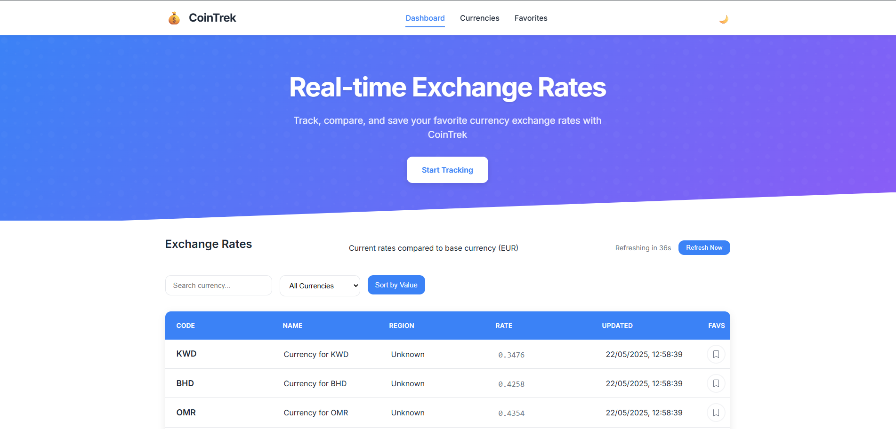

# CoinTrek – Real-time Exchange Rate Tracker

**CoinTrek** is een interactieve Single Page Webapplicatie waarmee gebruikers real-time wisselkoersen kunnen bekijken, filteren, sorteren en opslaan als favorieten. Gebouwd met JavaScript en de ExchangeRate API.

## Functionaliteiten

- Real-time wisselkoersen laden via externe API
- Zoekfunctie en sorteerknop op wisselkoerswaarde
- Filters op regio en favorieten
- Favorietenbeheer met opslag in `localStorage`
- Donkere modus en mobiele navigatie
- Auto-refresh met countdown timer
- Responsive design met een professioneel UI

## Gebruikte API

- **ExchangeRate API**  
  Endpoint: `https://v6.exchangerate-api.com/v6/<API_KEY>/latest/EUR`  
  Documentatie: [https://www.exchangerate-api.com](https://www.exchangerate-api.com)

## Installatiehandleiding

1. Clone de repo:
   ```bash
   git clone https://github.com/jouwgebruikersnaam/coingapp.git
   cd coingapp
   ```

2. Installeer dependencies:
   ```bash
   npm install
   ```

3. Start de ontwikkelserver:
   ```bash
   npm run dev
   ```

4. Open in browser op: `http://localhost:5173`

## Technische vereisten & waar ze te vinden zijn

| Vereiste                        | Bestand         | Lijn(en) |
|------------------------------- |------------------|----------|
| DOM manipulatie                | `main.js`, `ui.js`, `favorites.js` | 8, 62, 4 |
| Template literals              | `ui.js`, `main.js` | 72, 33 |
| Arrow functions                | `main.js`, `ui.js` | 11, 148 |
| Ternary operator               | `ui.js` | 81 |
| Fetch & Async Await            | `api.js`, `main.js` | 25, 8 |
| JSON verwerking                | `api.js` | 29–45 |
| localStorage                   | `cache.js`, `favorites.js` | 7, 22 |
| Responsive layout (CSS Grid)   | `style.css` | 88, 400+ |
| Sorteren en filteren           | `ui.js` | 89–108 |
| Observer API                   | `main.js` | 186-203 |


## 🖼 Screenshots



## 📘 Bronnen

- ExchangeRate API
- MDN Web Docs
- https://www.exchangerate-api.com/docs/overview
- https://stackoverflow.com/questions/66902719/how-do-i-store-my-selected-favorites-in-localstorage-javascript
- https://www.w3schools.com/jsrEF/default.asp
- https://chatgpt.com/share/682f0163-367c-8000-ac30-8cb6b049b408

